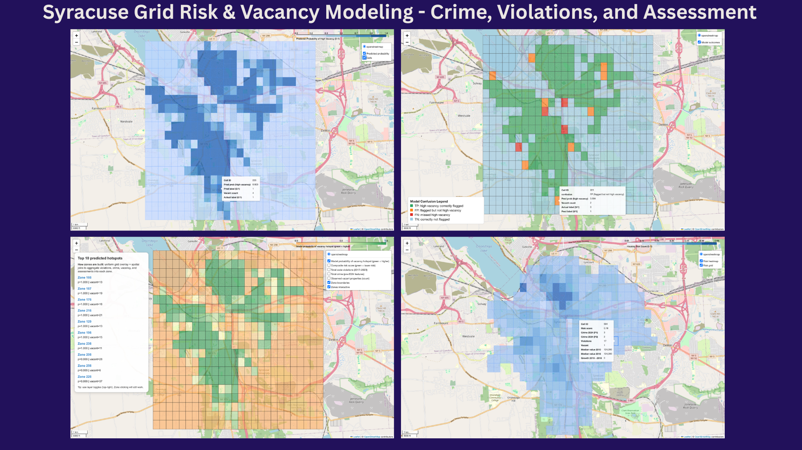
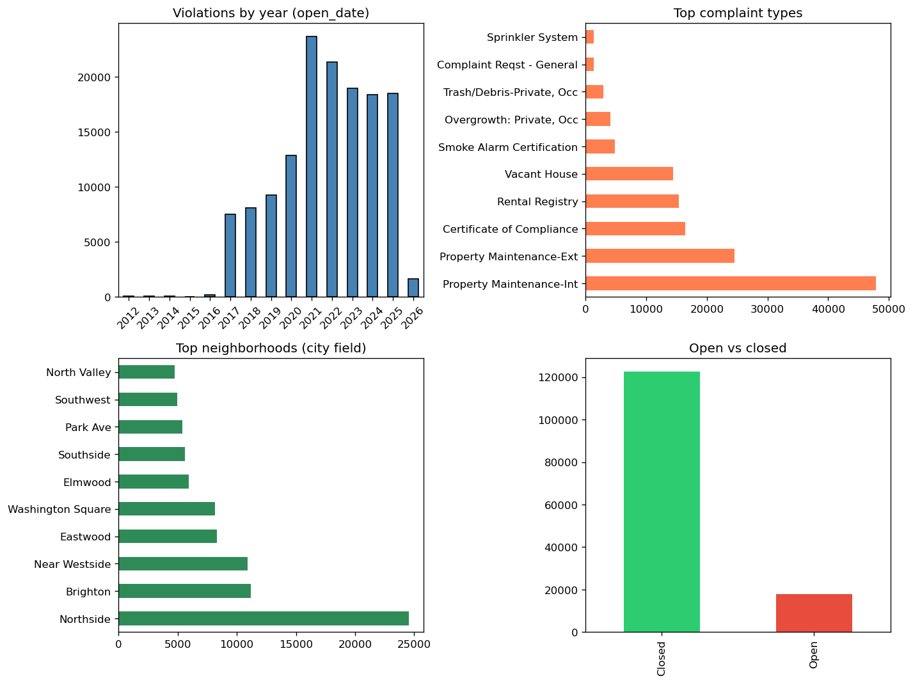

# DataThon: Syracuse code violations & property assessment



**Live site (GitHub Pages):** [https://snipofist.github.io/DataThon26/](https://snipofist.github.io/DataThon26/) · **Repository:** [SNIPOFIST/DataThon26](https://github.com/SNIPOFIST/DataThon26)

| Track | Name | Open the live view |
|-------|------|--------------------|
| **Track B (main hub)** | **LifeScientist — spatial grid & Folium maps** | [**Click here for Track B**](https://snipofist.github.io/DataThon26/) |
| **Track A** | **Code violations & property assessment (2025 roll)** — EDA & notebook | [**Click here for Track A**](https://snipofist.github.io/DataThon26/track-a.html) |

**Track A — source in repo:** [notebooks/Code_Violations_Assessment_Merge.ipynb](https://github.com/SNIPOFIST/DataThon26/blob/hari-local-datathon/notebooks/Code_Violations_Assessment_Merge.ipynb)

**Track B — map pages (use these links for full-page pan/zoom):**

- [Grid risk map](https://snipofist.github.io/DataThon26/lifescientist/risk_map.html)
- [Prediction dashboard](https://snipofist.github.io/DataThon26/lifescientist/prediction_dashboard.html)
- [Predicted vacancy probability map](https://snipofist.github.io/DataThon26/lifescientist/predicted_vacancy_probability_map.html)
- [Model confusion map](https://snipofist.github.io/DataThon26/lifescientist/model_confusion_map.html)

**Track B — pipeline docs:** [LifeScientist_track3 2/README.md](https://github.com/SNIPOFIST/DataThon26/tree/hari-local-datathon/LifeScientist_track3%202)

---

## Tech stack

[](https://www.python.org/)
[](https://jupyter.org/)
[](https://pandas.pydata.org/)
[](https://numpy.org/)
[](https://scikit-learn.org/)
[](https://matplotlib.org/)
[](https://seaborn.pydata.org/)
[](https://geopandas.org/)
[](https://python-visualization.github.io/folium/)
[](https://shapely.readthedocs.io/)

Install once from the repo root:

```bash
pip install -r requirements.txt
python -m src.data.export_preview_figures   # optional: refresh EDA PNG → reports/figures + docs/images
```

---

## Problem statement

We join Syracuse **code violations** to the **2025 assessment roll** on **SBL**, explore patterns, and model **total assessment** vs violation counts and property context. **Track B** builds a city **grid**, layers **crime / violations / vacancy / assessment** signals, and ships **Folium** risk and vacancy maps.

---

## Data source

- **[data.syr.gov](https://data.syr.gov/)** — violations and assessment CSVs in **`data/raw/`** (refresh when the city updates extracts).
- **Track B** — GeoJSON under **`LifeScientist_track3 2/code/data/raw/`** (see that README; **`Code_Violations_V2.geojson`** may be omitted from git due to size).

Rough scales: **~140k** violation rows, **~41k** roll parcels; merge is **left join** on normalized **SBL**.

---

## EDA summary

📊  &nbsp; 🏠  &nbsp; 🔗 **Join key:** normalized **`SBL`** (strip whitespace, string type).

<p align="center">
  
</p>

*Figure regenerated from **`data/raw/`** via `python -m src.data.export_preview_figures`. Canonical copy: **`reports/figures/`**; same file is mirrored to **`docs/images/`** for README and GitHub Pages.*

---

## Approach (how it was built)

1. **Ingest:** Load **`data/raw/Code_Violations.csv`** and **`data/raw/Assessment_Final_Roll_(2025).csv`**; rename assessment columns to a consistent **`Assess_*`** prefix and **left-join** violations to assessment on **`SBL`**.
2. **EDA:** Parse **`open_date`**, derive **year**, and chart **volume over time**, **top complaint types**, **neighborhood** frequency (city field), and **open vs closed** status (see figure above).
3. **Parcel table:** Aggregate to **one row per SBL** with **`violation_count`**, **`open_count`**, **`closed_count`**, and assessment attributes; this is the modeling grain for regression.
4. **Modeling:** **`sklearn`** **`Pipeline`** with **`ColumnTransformer`** — numeric violation features plus **`OneHotEncoder`** for **`Assess_Prop_Class_Description`** and **`Neighborhood`**; target **`Assess_Total_Assessment`** (**ordinary least squares** linear regression). Full steps live in **`notebooks/Code_Violations_Assessment_Merge.ipynb`**.
5. **Shared helpers:** **`src/utils/prediction_pipeline.py`** documents **`FEATURE_COLUMNS`**, **`TARGET_COLUMN`**, and **`build_parcel_dataframe()`** for the same contract without scrolling the notebook.
6. **Track B:** Grid construction and feature aggregation in **`LifeScientist_track3 2/code/src/`** → **Random Forest** → **Folium** HTML under **`docs/lifescientist/`** for **GitHub Pages** (interactive pan/zoom; not the raw GitHub file viewer).

---

## Project structure

```text
.
├── README.md
├── requirements.txt
├── .gitignore
├── configs/                      # place YAML/JSON experiment config here
├── data/
│   ├── raw/                      # official extracts (versioned)
│   ├── processed/                # merged outputs (gitignored where noted)
│   └── external/                 # optional third-party drops
├── notebooks/
│   └── Code_Violations_Assessment_Merge.ipynb
├── src/
│   ├── data/
│   │   └── export_preview_figures.py
│   ├── features/
│   ├── models/
│   ├── evaluation/
│   └── utils/
│       └── prediction_pipeline.py
├── reports/
│   ├── figures/                  # EDA PNGs (canonical); mirrored to docs/images for Pages
│   └── outputs/                  # optional exports (tables, etc.)
├── docs/                         # GitHub Pages site root
│   ├── index.html                # Track B hub (default map + sidebar)
│   ├── track-a.html              # Track A EDA page
│   ├── README.md
│   ├── images/
│   └── lifescientist/
└── LifeScientist_track3 2/       # Track B spatial pipeline (kept at repo root)
    ├── README.md
    ├── code/
    └── visualizations/
```

**Generated file:** `data/processed/Code_Violations_With_Assessment_2025.csv` (rebuild from the notebook; listed in `.gitignore`).

---

## Team

- Hari Ram Selvaraj  
- Avi Sharma  
- Saketh Kilaru  
- Akshaj Salvi  

---

## Business / public impact

Makes **open violations and assessment data** easier to browse together and shows **where** modeled risk clusters on a map—not a substitute for official city statistics or valuations.

---

## Conclusion & recommendation

**Conclusion:** Parcel-level joins plus regression summarize enforcement vs roll values; grid maps highlight spatial risk. **Recommendation:** Refresh **`data/raw/`** when **data.syr.gov** updates; pull large GeoJSON locally for Track B if missing from the repo.

---

## Author / links

- **Portfolio:** [mydatasciencegallery.shinyapps.io](https://mydatasciencegallery.shinyapps.io/)  
- **LinkedIn:** [linkedin.com/in/hariramselvaraj](https://www.linkedin.com/in/hariramselvaraj/)
